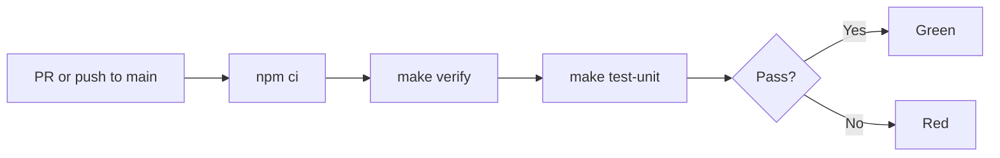

# {{cookiecutter.project_name}}

A workbench for standalone HTML artifacts — the copy-pasteable
single-file kind Claude produces — typed, tested, and iterated on
without losing the property that makes them copy-pasteable.

Deployed at <https://{{cookiecutter.deploy_host}}/>.

## Layout

```
src/<artifact-slug>/
├── artifact.html       # the shipping file, copy-pasteable
├── README.md           # what it is, current status
├── PROMPTS.md          # seed prompt + iteration log
├── notes.md            # design decisions (optional)
└── tests/              # unit.spec.ts (optional)
```

`public/` mirrors the deploy URLs exactly: `src/foo/artifact.html`
becomes `public/foo.html`, served from
`https://{{cookiecutter.deploy_host}}/foo.html`.

## Quickstart

```bash
make install   # npm install
make verify    # static checks (structure, types, html)
make test      # runtime checks (unit)
make build     # src/*/artifact.html -> public/
make ci        # verify && test && build
```

Scope to one artifact: `make verify ARTIFACT=<slug>`.

## Adding an artifact

See [docs/authoring.md](docs/authoring.md). One-paragraph version:
make a directory under `src/`, drop in `artifact.html`, write a
`README.md` and `PROMPTS.md` next to it, add an entry to
`docs/manifest.yml`. `make verify-structure` rejects an artifact
that's missing the README or PROMPTS file.

## Verifying changes

See [docs/verification.md](docs/verification.md). Two layers: fast
static checks via `make verify`, runtime jsdom checks via
`make test`. Add tests opt-in, the first time you catch a regression
you wish you'd caught automatically.

## CI

The project ships with a GitHub Actions workflow at `.github/workflows/ci.yml` that runs the fast verify gate on every pull request and on push to `main`:

1. `npm ci`
2. `make verify` — structure + types (tsc `--checkJs`) + html-validate
3. `make test-unit` — vitest/jsdom unit specs

No browser binaries — the job completes in under a minute. End-to-end (browser) tests are planned for a future release via a lightweight rodney-based replacement; see `cookbook/notes/artifact-bench.md` "Deferred work" for status.

To run the same gate locally:

```bash
npm install && make verify && make test-unit
```



