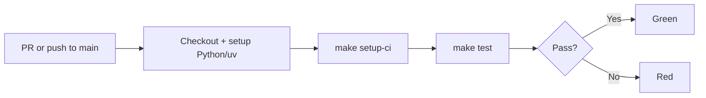

# python-project template demo

*2026-04-19T15:59:07Z by Showboat 0.6.1*
<!-- showboat-id: c87fe4eb-0496-4c29-a83e-d38dcfa11ab9 -->

The python-project template scaffolds a uv-managed Python project with ruff, mypy, pytest, and direnv support. It includes a baseline `hello_world` implementation so `make test` passes immediately after baking. v1.1 adds an `include_github_workflows` flag that bakes a `.github/workflows/ci.yml` and a `make setup-ci` target so generated projects ship with an opinionated CI gate.

Bake the template with defaults (project_name=Fresh Project, include_github_workflows=yes):

```bash
rm -rf /tmp/python-project-demo && /home/user/recipes/.venv/bin/cookiecutter /home/user/recipes/cookbook/python-project --no-input --output-dir /tmp/python-project-demo && find /tmp/python-project-demo/fresh-project -type f | sort | sed "s|/tmp/python-project-demo/||"
```

```output
fresh-project/.envrc
fresh-project/.gitattributes
fresh-project/.github/workflows/ci.yml
fresh-project/.gitignore
fresh-project/AGENTS.md
fresh-project/Makefile
fresh-project/README.md
fresh-project/docs/spec.md
fresh-project/fresh_project/__init__.py
fresh-project/fresh_project/main.py
fresh-project/pyproject.toml
fresh-project/scripts/.gitkeep
fresh-project/tests/test_main.py
```

The `.github/workflows/ci.yml` gated by the flag runs `make setup-ci && make test` on every PR and on push to main:

```bash
cat /tmp/python-project-demo/fresh-project/.github/workflows/ci.yml
```

```output
# CI workflow for fresh-project.
#
# Runs the full `make test` gate on every pull request and on push to
# main. See README.md's "CI" section for the trigger-to-step flow
# and the local-equivalent commands.

name: CI

on:
  pull_request:
  push:
    branches:
      - main

jobs:
  test:
    runs-on: ubuntu-latest
    steps:
      - name: Checkout repository
        uses: actions/checkout@v4

      - name: Set up Python
        uses: actions/setup-python@v5
        with:
          python-version: '3.13'

      - name: Set up uv
        uses: astral-sh/setup-uv@v4

      - name: Install CI-locked dependencies
        run: make setup-ci

      - name: Run test gate
        run: make test
```

`make help` lists the new `setup-ci` target alongside the existing development targets:

```bash
make -C /tmp/python-project-demo/fresh-project help
```

```output
make: Entering directory '/tmp/python-project-demo/fresh-project'
Target       Description
------       -----------
check        Lint and auto-fix issues with ruff.
clean        Remove build, cache, venv, lock, and dist artifacts.
dist         Prepare a versioned release in dist/.
format       Format code using ruff.
mypy         Type-check sources with mypy after format/check.
setup-ci     Install CI-locked dependencies (uv sync --frozen).
test         Run tests with coverage after check, format, and mypy.
make: Leaving directory '/tmp/python-project-demo/fresh-project'
```

The baked README gains a `## CI` section linking the workflow file to its local-equivalent commands, with a Mermaid flowchart showing the trigger-to-step path:

```bash
sed -n "/^## CI/,/^## /p" /tmp/python-project-demo/fresh-project/README.md | sed "$ d"
```

````output
## CI

The project ships with a GitHub Actions workflow at `.github/workflows/ci.yml` that runs `make test` on every pull request and on push to `main`. To run the same gate locally:

```bash
make setup-ci && make test
```

`make setup-ci` is the CI-specific analog of the `First run` quickstart — it uses `uv sync --frozen` to enforce lockfile fidelity, catching drift that would otherwise surface only in CI.


````

Setting `include_github_workflows=no` removes the `.github/` directory via the post-generation hook, leaving the rest of the project scaffold intact for users who don't want CI:

```bash
rm -rf /tmp/python-project-demo-no-wf && /home/user/recipes/.venv/bin/cookiecutter /home/user/recipes/cookbook/python-project --no-input --output-dir /tmp/python-project-demo-no-wf include_github_workflows=no 2>&1; test -d /tmp/python-project-demo-no-wf/fresh-project/.github && echo ".github/ exists" || echo "No .github/ directory"; test -f /tmp/python-project-demo-no-wf/fresh-project/Makefile && echo "Makefile still present"
```

```output
No .github/ directory
Makefile still present
```
