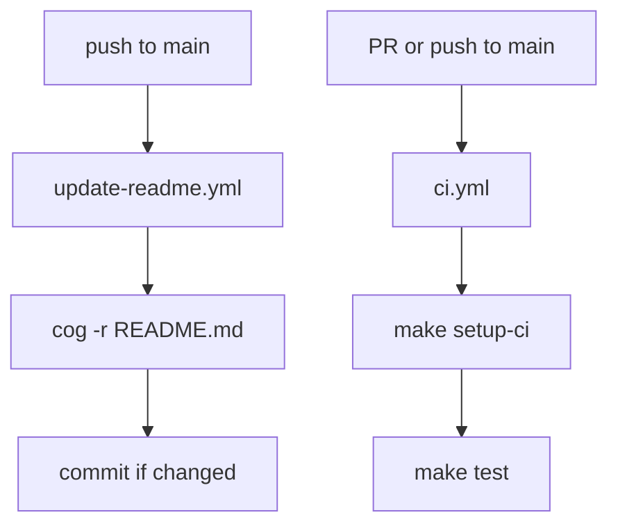

# repo-cli template demo

*2026-04-19T16:05:00Z*

The repo-cli template scaffolds a Click-based CLI project targeting a specific repository. The baked package uses a `_cli` suffix by convention (`<target_repo>_cli`) so it never collides with the host repo's library package. v1.1 renames the `include_github_workflow` flag to `include_github_workflows` (plural) and extends it to gate a new `.github/workflows/ci.yml` alongside the existing `update-readme.yml` — the rename reflects that the flag now ships multiple workflow files.

```bash
rm -rf /tmp/repo-cli-demo && /home/user/recipes/.venv/bin/cookiecutter /home/user/recipes/cookbook/repo-cli --no-input --output-dir /tmp/repo-cli-demo && find /tmp/repo-cli-demo/my-repo-cli -type f | sort | sed 's|/tmp/repo-cli-demo/||'
```

```output
my-repo-cli/.envrc
my-repo-cli/.gitattributes
my-repo-cli/.github/workflows/ci.yml
my-repo-cli/.github/workflows/update-readme.yml
my-repo-cli/.gitignore
my-repo-cli/CHANGELOG.md
my-repo-cli/Makefile
my-repo-cli/README.md
my-repo-cli/my_repo_cli/AGENTS.md
my-repo-cli/my_repo_cli/tui/__init__.py
my-repo-cli/my_repo_cli/tui/cli.py
my-repo-cli/my_repo_cli/tui/dashboard.py
my-repo-cli/my_repo_cli/tui/status.py
my-repo-cli/my_repo_cli/tui/template.py
my-repo-cli/pyproject.toml
my-repo-cli/requirements.txt
my-repo-cli/tests/test_cli.py
my-repo-cli/tests/test_dashboard.py
my-repo-cli/tests/test_status.py
my-repo-cli/tests/test_template.py
my-repo-cli/tests/test_template_apply.py
my-repo-cli/tests/test_template_prepare.py
```

Notable files: `template.py` (Cog-based README management), both workflow files under `.github/workflows/` (`ci.yml` runs the test gate, `update-readme.yml` regenerates README content via cogapp), `requirements.txt` (cogapp for CI), and the template/status/dashboard test trio. The `_cli` suffix (`my_repo_cli/`) is derived automatically from `target_repo` via Jinja2 `replace('-', '_')` filter.

The new `ci.yml` runs `make setup-ci && make test` on every pull request and on push to main:

```bash
cat /tmp/repo-cli-demo/my-repo-cli/.github/workflows/ci.yml
```

```output
# CI workflow for my-repo-cli.
#
# Runs the full `make test` gate on every pull request and on push to
# main. This is the test-gate workflow; update-readme.yml is a
# separate workflow that regenerates README content via cogapp on
# push to main. See README.md's "CI" section for the trigger-to-step
# flow covering both workflows.

name: CI

on:
  pull_request:
  push:
    branches:
      - main

jobs:
  test:
    runs-on: ubuntu-latest
    steps:
      - name: Checkout repository
        uses: actions/checkout@v4

      - name: Set up Python
        uses: actions/setup-python@v5
        with:
          python-version: '3.13'

      - name: Set up uv
        uses: astral-sh/setup-uv@v4

      - name: Install CI-locked dependencies
        run: make setup-ci

      - name: Run test gate
        run: make test
```

The CLI entry point is registered as `my-repo`. Invoke it with no arguments to see help:

```bash
cd /tmp/repo-cli-demo/my-repo-cli && uv run --quiet my-repo help
```

```output
Usage: my-repo [OPTIONS] COMMAND [ARGS]...

  My Repo CLI.

Options:
  --help  Show this message and exit.

Commands:
  hello     Say hello.
  help      Show this help message and exit.
  template  Manage the my-repo README Cog template.
```

Commands are listed alphabetically. The `template` group is new in v0.9 — it manages the Cog-based README template. Invoke it without a subcommand to see the template code:

```bash
cd /tmp/repo-cli-demo/my-repo-cli && uv run --quiet my-repo template
```

```output
...
```

The `apply` subcommand replaces `<template placeholder>` in README.md with a Cog-wrapped block. The `prepare` subcommand reverses it — stripping Cog markers back to the placeholder:

```bash
cd /tmp/repo-cli-demo/my-repo-cli && cat README.md && echo '---' && uv run my-repo template apply && echo '---' && cat README.md
```

````output
# My Repo CLI

<template placeholder>

## Setup

```bash
uv sync && direnv allow
```

## Development

```bash
make test
```

## CI

Two GitHub Actions workflows ship with this project:

- `.github/workflows/ci.yml` runs the `make test` gate on every pull request and on push to `main`.
- `.github/workflows/update-readme.yml` regenerates README content via `cog -r` on push to `main`, then commits the update if anything changed.

To run the CI test gate locally:

```bash
make setup-ci && make test
```

`make setup-ci` uses `uv sync --frozen` — the CI-specific analog of `uv sync` in `Setup`, which enforces lockfile fidelity and catches drift that would otherwise surface only in CI.



## Release

```bash
make dist
```
---
Template applied to README.md
---
# My Repo CLI

<!--[[[cog
...
]]]-->
<!--[[[end]]]-->

## Setup

```bash
uv sync && direnv allow
```

## Development

```bash
make test
```

## CI

Two GitHub Actions workflows ship with this project:

- `.github/workflows/ci.yml` runs the `make test` gate on every pull request and on push to `main`.
- `.github/workflows/update-readme.yml` regenerates README content via `cog -r` on push to `main`, then commits the update if anything changed.

To run the CI test gate locally:

```bash
make setup-ci && make test
```

`make setup-ci` uses `uv sync --frozen` — the CI-specific analog of `uv sync` in `Setup`, which enforces lockfile fidelity and catches drift that would otherwise surface only in CI.


## Release

```bash
make dist
```
````

```bash
cd /tmp/repo-cli-demo/my-repo-cli && uv run --quiet my-repo template prepare && cat README.md
```

````output
Template prepared in README.md
# My Repo CLI

<template placeholder>

## Setup

```bash
uv sync && direnv allow
```

## Development

```bash
make test
```

## CI

Two GitHub Actions workflows ship with this project:

- `.github/workflows/ci.yml` runs the `make test` gate on every pull request and on push to `main`.
- `.github/workflows/update-readme.yml` regenerates README content via `cog -r` on push to `main`, then commits the update if anything changed.

To run the CI test gate locally:

```bash
make setup-ci && make test
```

`make setup-ci` uses `uv sync --frozen` — the CI-specific analog of `uv sync` in `Setup`, which enforces lockfile fidelity and catches drift that would otherwise surface only in CI.


## Release

```bash
make dist
```
````

The GitHub Actions workflow (`update-readme.yml`) automates this: on push to main, it runs `prepare`, `apply`, and `cog -r` to regenerate README content. The workflow is conditional — baking with `include_github_workflows=no` removes the `.github/` directory via the post-generation hook:

```bash
rm -rf /tmp/repo-cli-no-wf && /home/user/recipes/.venv/bin/cookiecutter /home/user/recipes/cookbook/repo-cli --no-input --output-dir /tmp/repo-cli-no-wf include_github_workflows=no 2>&1; test -d /tmp/repo-cli-no-wf/my-repo-cli/.github && echo '.github/ exists' || echo 'No .github/ directory — removed by post-gen hook'
```

```output
No .github/ directory — removed by post-gen hook
```

The baked project includes 62 tests (5 CLI + 57 template). All pass out of the box:

```bash
cd /tmp/repo-cli-demo/my-repo-cli && uv run --quiet pytest --tb=no -q
```

```output
..............................................................           [100%]
62 passed in 0.45s
```
