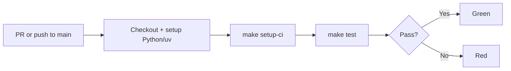

# {{cookiecutter.package_name}}

TBD defining {{cookiecutter.project_name}}

## Opinionated goals

## Solution details

## First run
Install dependencies using `uv` before enabling `direnv` with this oneliner:

```bash
uv sync && direnv allow
```

## Tests
Run the test suite:

```bash
make test
```

## CI

The project ships with a GitHub Actions workflow at `.github/workflows/ci.yml` that runs `make test` on every pull request and on push to `main`. To run the same gate locally:

```bash
make setup-ci && make test
```

`make setup-ci` is the CI-specific analog of the `First run` quickstart — it uses `uv sync --frozen` to enforce lockfile fidelity, catching drift that would otherwise surface only in CI.



