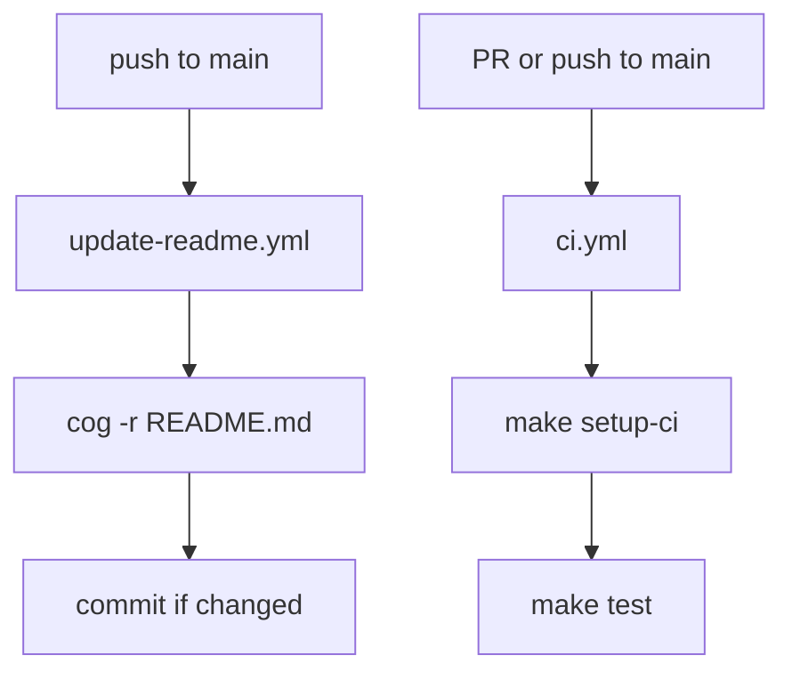

# {{cookiecutter.project_name}}

<template placeholder>

## Setup

```bash
uv sync && direnv allow
```

## Development

```bash
make test
```

## CI

Two GitHub Actions workflows ship with this project:

- `.github/workflows/ci.yml` runs the `make test` gate on every pull request and on push to `main`.
- `.github/workflows/update-readme.yml` regenerates README content via `cog -r` on push to `main`, then commits the update if anything changed.

To run the CI test gate locally:

```bash
make setup-ci && make test
```

`make setup-ci` uses `uv sync --frozen` — the CI-specific analog of `uv sync` in `Setup`, which enforces lockfile fidelity and catches drift that would otherwise surface only in CI.



## Release

```bash
make dist
```
