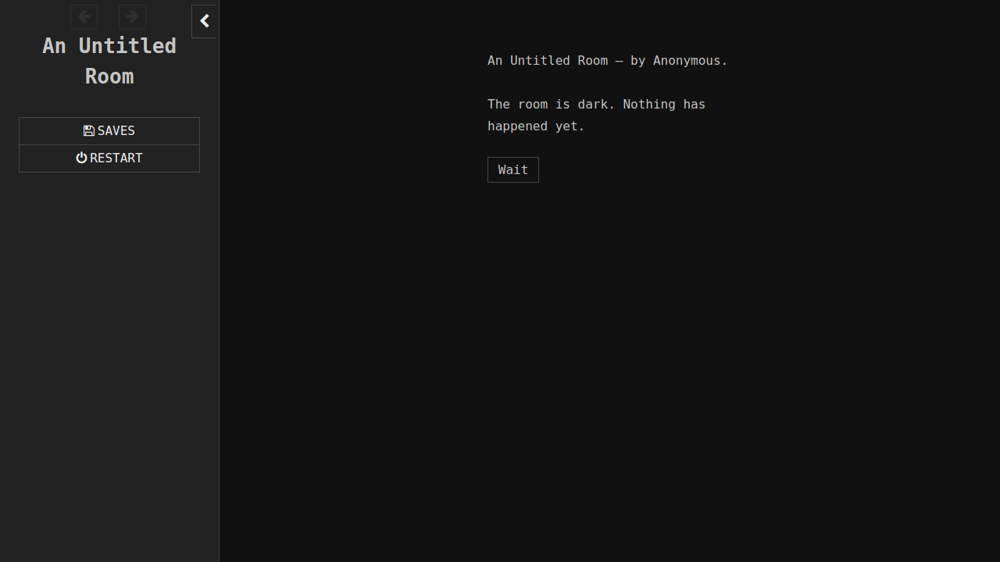
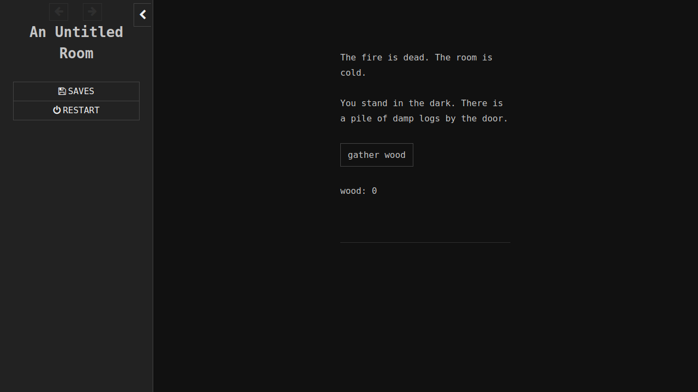
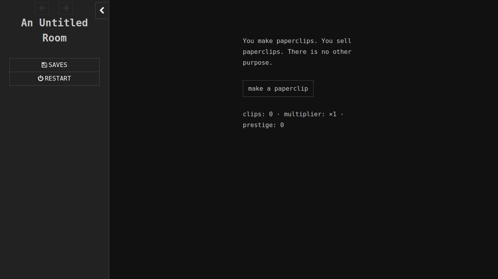
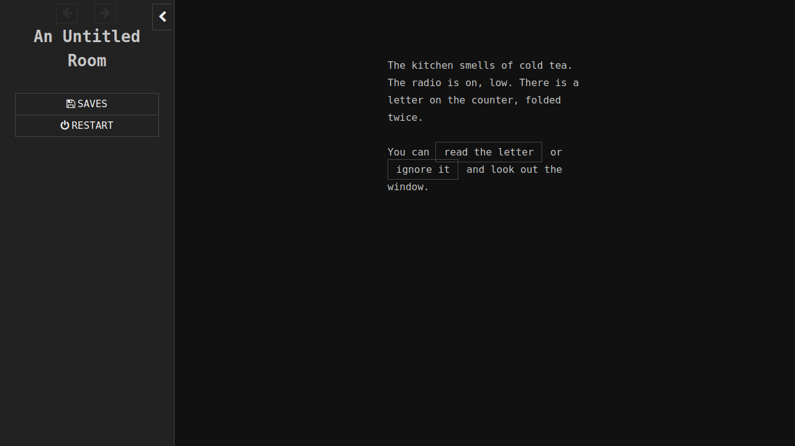
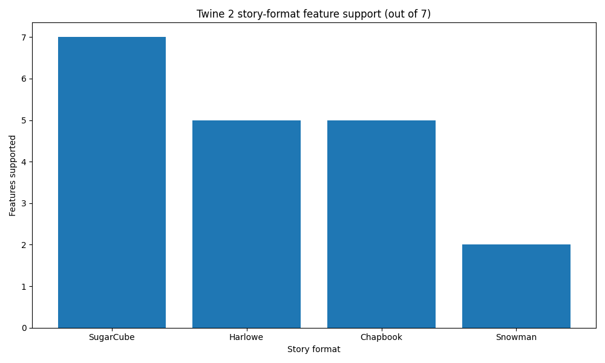
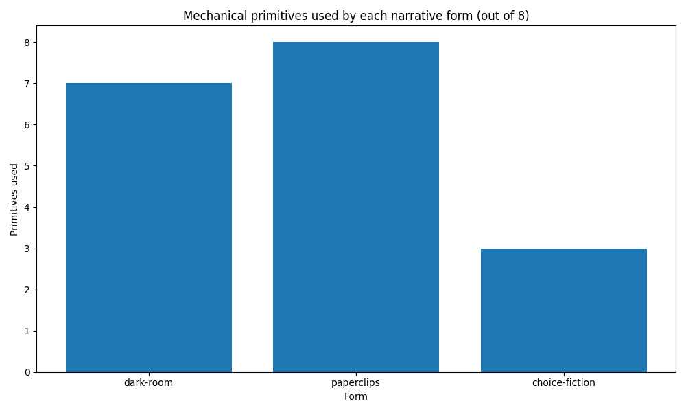

# narrative-game-template walkthrough

*2026-04-29T01:11:51Z by Showboat 0.6.1*
<!-- showboat-id: 1fbbb1a1-ecfa-4436-8b7c-bdb5789339f1 -->

A single cookiecutter template that scaffolds a **Twine 3 narrative game**, compiled to a self-contained HTML by the [`tweego`](https://www.motoslave.net/tweego/) Go binary. The template ships with example crib-sheets for three opinionated forms — *A Dark Room*-style found-UI clickers, *Universal Paperclips*-style numerical clickers, and IFComp-style choice fiction — and verifies its output end-to-end via headless Chrome through `rodney`.

This document is built and re-verified by [showboat](https://github.com/Gretyl/showboat); display-only Twine snippets use HTML `<pre><code>` so they round-trip cleanly through `showboat verify`.

## What the default bake renders

A no-input bake drops a complete Twee 3 project into the working directory. After `make setup-twine && make dist`, the resulting `dist/index.html` looks like this in headless Chrome:

```bash {image}

```


The diegetic dim background, the monospaced narrow column, and the single `[[Wait]]` link are the *starting marks* the template ships — not commitments. The `StoryStylesheet.twee` passage is meant to be edited freely.

## What the template can express

The same skeleton, extended with the SugarCube macros catalogued in `examples/`, produces all three of the reference forms named in the task brief.

### A Dark Room — found-UI clicker

Resource pool, action button, append-only poetic log.

```bash {image}

```


<pre><code>:: Start
&lt;&lt;set $wood to 0&gt;&gt;
&lt;&lt;set $log to []&gt;&gt;

The fire is dead. The room is cold.

You stand in the dark. There is a pile of damp logs by the door.

&lt;&lt;button "gather wood"&gt;&gt;
&lt;&lt;set $wood++&gt;&gt;
&lt;&lt;set $log.push("the wood is heavy.")&gt;&gt;
&lt;&lt;replace "#stats"&gt;&gt;wood: $wood&lt;&lt;/replace&gt;&gt;
&lt;&lt;replace "#feed"&gt;&gt;&lt;&lt;print $log.slice(-3).join("&lt;br&gt;")&gt;&gt;&lt;&lt;/replace&gt;&gt;
&lt;&lt;/button&gt;&gt;

&lt;div id="stats"&gt;wood: $wood&lt;/div&gt;
&lt;div id="feed" class="log"&gt;&lt;/div&gt;
&lt;&lt;if $wood gte 5&gt;&gt;[[The pile is enough.|Builder]]&lt;&lt;/if&gt;&gt;
</code></pre>

### Universal Paperclips — numerical clicker

Resource + multiplier + auto-tick + prestige reset.

```bash {image}

```


<pre><code>:: Start
&lt;&lt;set $clips to 0&gt;&gt;
&lt;&lt;set $multiplier to 1&gt;&gt;
&lt;&lt;set $autoclip to false&gt;&gt;

You make paperclips. You sell paperclips. There is no other purpose.

&lt;&lt;button "make a paperclip"&gt;&gt;
  &lt;&lt;set $clips += $multiplier&gt;&gt;
  &lt;&lt;replace "#stats"&gt;&gt;clips: $clips · multiplier: ×$multiplier&lt;&lt;/replace&gt;&gt;
&lt;&lt;/button&gt;&gt;

&lt;&lt;timed 1s&gt;&gt;
  &lt;&lt;if $autoclip&gt;&gt;
    &lt;&lt;set $clips += $multiplier&gt;&gt;
  &lt;&lt;/if&gt;&gt;
&lt;&lt;/timed&gt;&gt;
</code></pre>

### Choice fiction — branching prose

`[[Display|Target]]` links, flag variables, in-place beats.

```bash {image}

```


<pre><code>:: Start
&lt;&lt;set $kept_letter to false&gt;&gt;

The kitchen smells of cold tea. The radio is on, low. There is a
letter on the counter, folded twice.

You can [[read the letter|Letter]] or [[ignore it|Window]] and look
out the window.
</code></pre>

## Why SugarCube? Why Twine?

`tweego` bundles four Twine 2 story formats. Their feature support
ranges from sparse (Snowman, two of seven) to comprehensive
(SugarCube, seven of seven), with Harlowe and Chapbook in between:

```bash {image}

```


SugarCube is the cookiecutter default because it has macros for all eight mechanical primitives the three reference forms lean on (resource pool, action button, cooldown, event interrupt, upgrade, passage transition, log append, prestige) — so a single project tree can express any point in the form-spectrum without scaffolding three separate skeletons.

The expressive ceiling per form, by primitive count:

```bash {image}

```


A pure choice-fiction story uses ~3 primitives; a paperclips-style clicker uses all 8. SugarCube covers the union.

## Build & verify in three commands

The cookiecutter prompts (with the four bundled tweego story formats and the IFID synthesis defaults) are visible in the source `cookiecutter.json`:

```bash
cat cookiecutter.json
```

```output
{
  "project_slug": "my-narrative",
  "title": "An Untitled Room",
  "author_name": "Anonymous",
  "story_format": ["sugarcube", "harlowe", "chapbook", "snowman"],
  "ifid": "",
  "include_github_workflow": ["yes", "no"],
  "_format_proper": {
    "sugarcube": "SugarCube",
    "harlowe": "Harlowe",
    "chapbook": "Chapbook",
    "snowman": "Snowman"
  }
}
```

Once baked, the project ships a Makefile with `make test` as the single pre-commit gate per Gretyl/recipes cookbook convention. Three commands take a fresh bake to a verified build:

<pre><code>cookiecutter narrative-game-template/        # baked into ./my-narrative
cd my-narrative

make setup-twine    # downloads tweego 2.1.1 into .tweego/ (one-time)
make dist           # tweego compiles src/*.twee → dist/index.html
make test           # full pipeline (setup-twine + dist + rodney smoke)
</code></pre>

The smoke test (`tests/test_smoke.py`) drives a headless Chrome via the `rodney` CLI and asserts that the start passage renders with non-empty text and that clicking the first link transitions to a different passage. Selectors are SugarCube-default; the docstring includes the swap table for Harlowe / Chapbook / Snowman.

## Layout

The baked project tree:

<pre><code>my-narrative/
├── README.md
├── Makefile             # setup-twine / dist / test / clean
├── pyproject.toml       # rodney + pytest as dev deps
├── .gitignore           # dist/, .tweego/, .rodney/
├── scripts/install-tweego.sh   # platform-aware tweego downloader
├── src/                          # Twee 3 source consumed by tweego
│   ├── StoryData.twee            # IFID + format declaration
│   ├── StoryTitle.twee           # game title
│   ├── StoryStylesheet.twee      # default diegetic-UI CSS
│   ├── StoryScript.twee          # author JS hooks
│   ├── StoryInit.twee            # initial state
│   └── Start.twee                # entry passage
├── examples/                     # crib-sheets — NOT compiled by default
│   ├── README.md
│   ├── dark-room.twee
│   ├── paperclips.twee
│   └── choice-fiction.twee
└── tests/
    ├── conftest.py                # session-scoped dist_html fixture
    └── test_smoke.py              # rodney browser drive
</code></pre>

## TDD round summary

The upstream `narrative-game-template/` working in grimoire shipped this template through nine numbered TDD rounds:

  1. cookiecutter.json prompts — RED + GREEN
  2. source-passage skeleton — RED + GREEN
  3. build harness (Makefile + install script + tests) — RED + GREEN
  4. pre_gen_project rejects bad slugs — RED + GREEN
  5. blank IFID synthesises a UUID4 in StoryData — RED + GREEN
  6. StoryData parses across all four story-format choices — test-after
  7. setup-twine downloads working tweego — RED + GREEN, network-gated
  8. make dist compiles src/* into dist/index.html — test-after, network-gated
  9. rodney browser smoke + end-to-end baked pipeline gate — test-after, network-gated

Round 7 was a real RED: the round 3 install script ended with `"$BIN" -v` to print the version, but tweego's `-v` flag exits 1 (informational, not error), and `set -e` propagated that into the script's exit code. The round 7 GREEN swallowed the `tweego -v` return value with `|| true`.

Default suite (no network): **58 passed + 12 skipped**.
With `TWEEGO_NETWORK_TESTS=1`: **70 passed**.
